# Создание виртуальную машину

Буду создавать ВМ в Yandex Cloud согласно инструкции: https://yandex.cloud/ru/docs/compute/quickstart/quick-create-linux

## Создание каталога

В своём профиле Yandex Cloud создаю каталог "postgresql".

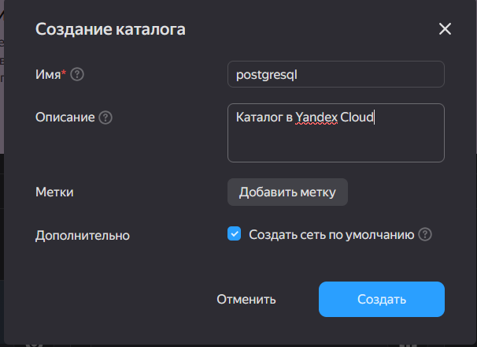

## Добавление SSH ключа

Инструкция по созданию SSH-ключа для Windows 11: https://yandex.cloud/ru/docs/compute/operations/vm-connect/ssh#windows_2

### Обновление PowerShell

Выполняю команды по установке PowerShell 7 через winget:
```
winget install --id Microsoft.PowerShell --source winget
```

```
winget install --id Microsoft.PowerShell --source winget --installer-type wix
```

После обновления настраиваю терминал Windows на использование Power Shell 7 по умолчанию. Для этого:
1. Открываю Windows Terminal.
2. Открываю "Settings" через галочку сверху.
3. В "Startup" -> "Default Profile" ставлю PowerShell 7
4. В "PowerShell" -> "Run this profile as Administrator" ставлю "on"

### Установка OpenSSH

Проверяю что используется версия PowerShell не менее 5.1
```
$PSVersionTable.PSVersion

Major  Minor  Patch  PreReleaseLabel BuildLabel
-----  -----  -----  --------------- ----------
7      6      1
```

Проверяю, что являюсь администратором:
```
(New-Object Security.Principal.WindowsPrincipal([Security.Principal.WindowsIdentity]::GetCurrent())).IsInRole([Security.Principal.WindowsBuiltInRole]::Administrator)
True
```

Проверяю установлен ли OpenSSH:
```
Get-WindowsCapability -Online | Where-Object Name -like 'OpenSSH.Server*'
```

Получаю ошибку `Get-WindowsCapability: Класс не зарегистрирован`. Запускаю диагностику DISM:
```
DISM /Online /Cleanup-Image /CheckHealth
DISM /Online /Cleanup-Image /RestoreHealth
```

Запускаю проверку целостности системных файлов:
```
sfc /scannow
```

Проблема оказалось в том, что новая версия PowerShell не умеет работать с WindowsCompatibility.

Удаляю старые модули:
```
Uninstall-Module -Name WindowsCompatibility -AllVersions -Force
```

Устанавливаю модуль совместимости:
```
Install-Module -Name WindowsCompatibility -Force
Import-Module -Name Dism -UseWindowsPowerShell
```

Проверяю установлен ли OpenSSH:
```
Get-WindowsCapability -Online | Where-Object Name -like 'OpenSSH.Server*'

Name  : OpenSSH.Server~~~~0.0.1.0
State : NotPresent
```

Устанавливаем OpenSSH:
```
Add-WindowsCapability -Online -Name OpenSSH.Server~~~~0.0.1.0
```

Устанавливаем OpenSSH клиент:
```
Add-WindowsCapability -Online -Name OpenSSH.Client~~~~0.0.1.0
```

Так как установка через Add-WindowsCapability не добавляет в PATH путь до бинарников автоматически, было решено использовать графическую установку.

Параметры -> Система -> Дополнительные компоненты -> Добавление дополнительного компонента -> Клиент OpenSSH.

Теперь мы можем сгенерировать ключ:
```
ssh-keygen -t ed25519 -C "Ключ для ВМ в Yandex Cloud"
```

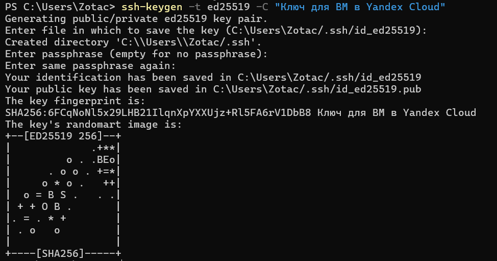

Ключ появился в директории `C:\Users\Zotac/.ssh`
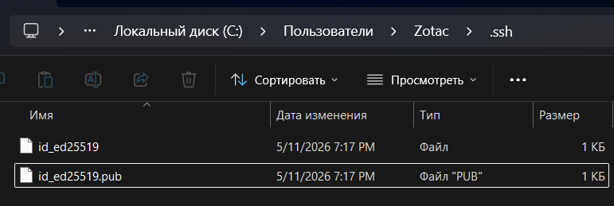
## Создание ВМ

На странице создания ВМ выбираю:
1. ОС - Ubuntu
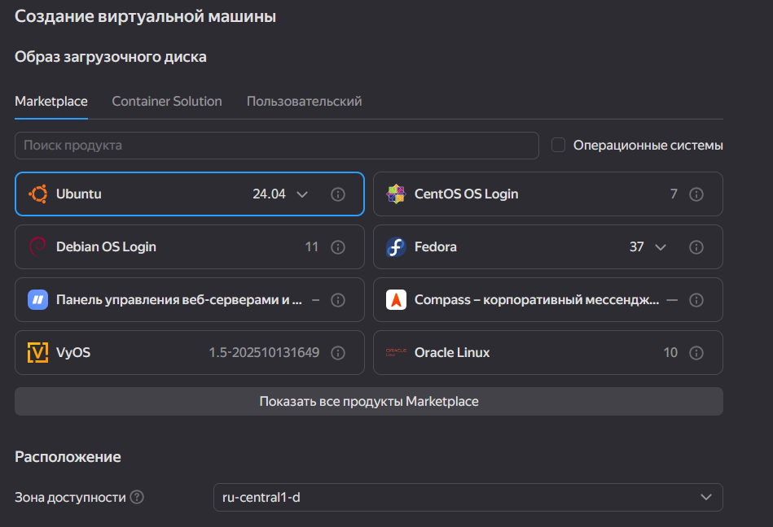
2. Диск - SSD 20ГБ

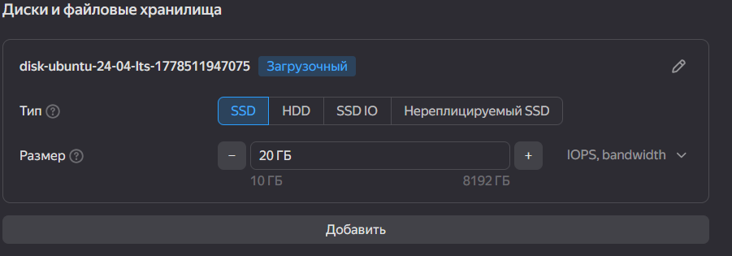
3. Вычислительные ресурсы: 2vCPU и 2ГБ RAM
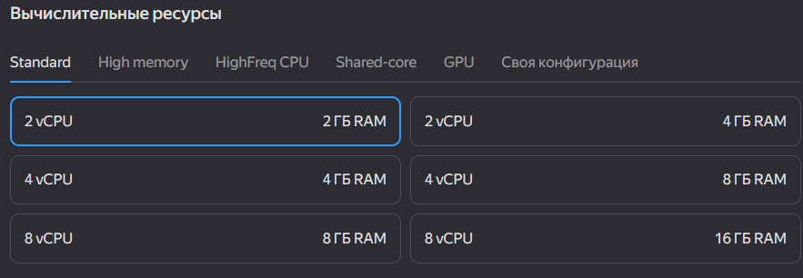

4. Сеть - Стандартные сетевые настройки:
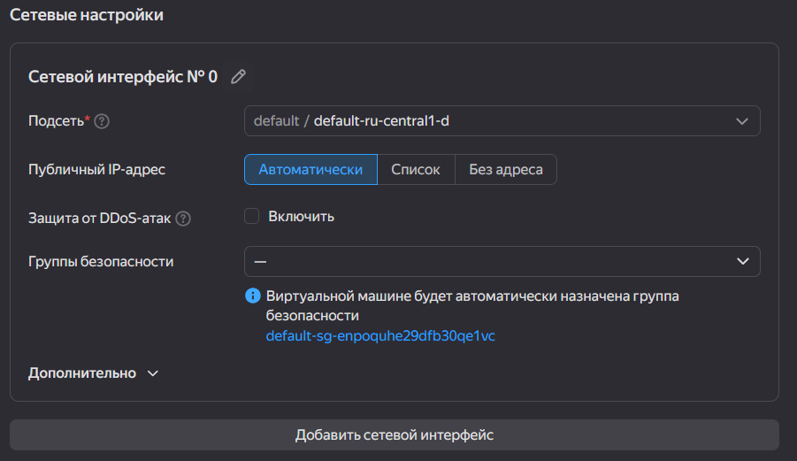

5. Ключ - Добавляю созданный ранее ключ:
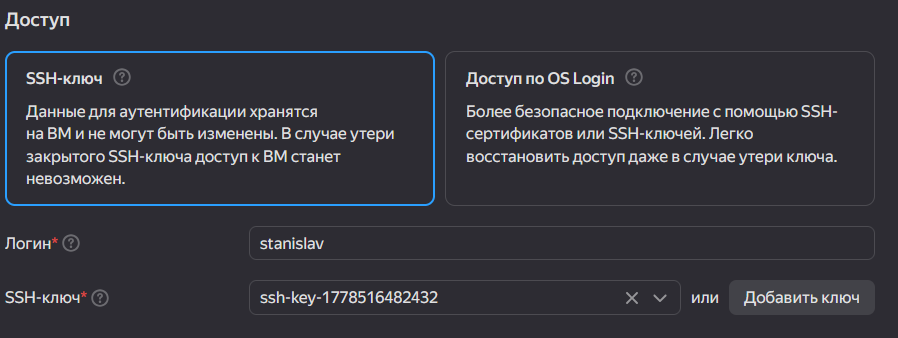

Нажимаю `Создать ВМ`
# Подключение к ВМ

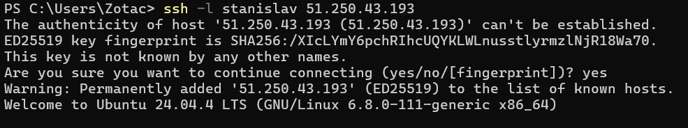
# Установка PostgreSQL

```
sudo apt update
sudo apt install postgresql-16
```

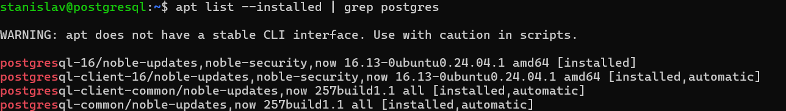

# Подключение к PostrgreSQL

Открываю два подключения к PostgreSQL:
```
sudo -u postgres psql
```
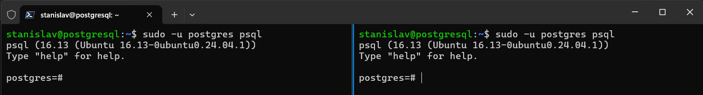

# Подготовка к проверкам уровней изоляции

Отключаю авто-коммит:
```
\set AUTOCOMMIT off
```

Создаю тестовую таблицу:
```
create table shipments(id serial, product_name text, quantity int, destination text);
insert into shipments(product_name, quantity, destination) values('bananas', 1000, 'Europe');
insert into shipments(product_name, quantity, destination) values('coffee', 500, 'USA');
commit;
```

# Изучение уровней изоляции

Краткая информация по уровням изорляции:
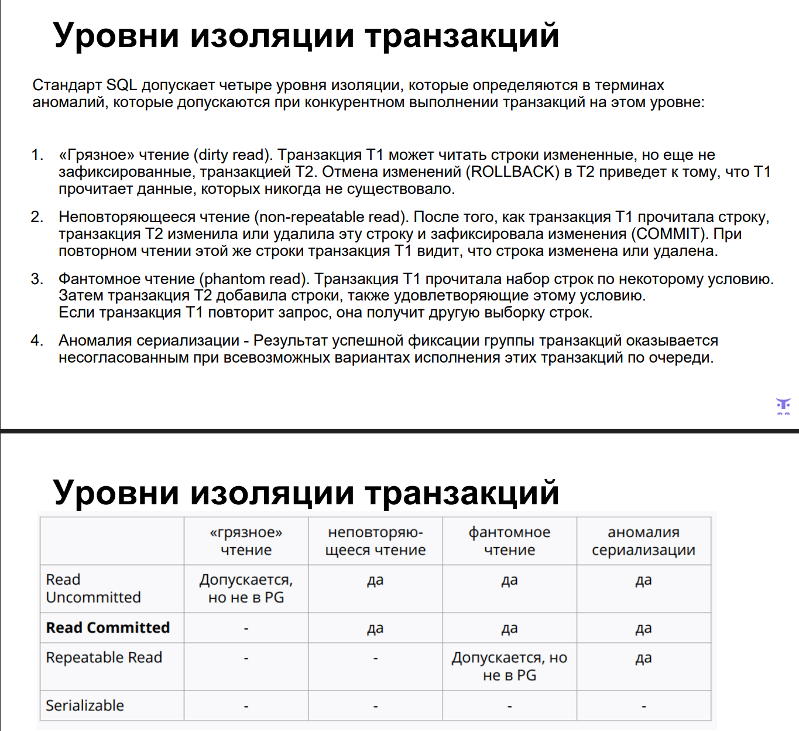

Проверка текущего уровня изоляции:
```
postgres=# show transaction isolation level;
 transaction_isolation
-----------------------
 read committed
(1 row)
```

В первой сессии выводим содержимое таблицы `shipments`: 
```
postgres=# SELECT * FROM shipments;
 id | product_name | quantity | destination
----+--------------+----------+-------------
  1 | bananas      |     1000 | Europe
  2 | coffee       |      500 | USA
(2 rows)
```

Во второй сессии добавляем данные:
```
postgres=# insert into shipments(product_name, quantity, destination) values('sugar', 300, 'Asia');
INSERT 0 1
```

В первой сессии выводим содержимое таблицы `shipments`: 
```
postgres=*# SELECT * FROM shipments;
 id | product_name | quantity | destination
----+--------------+----------+-------------
  1 | bananas      |     1000 | Europe
  2 | coffee       |      500 | USA
(2 rows)
```

Мы не видим новые данные, т.к. включён режим изоляции `read committed`, при котором не допускается `грязное чтение`.

Во второй сессии завершаем транзакцию:
```
commit;
```

В первой сессии выводим содержимое таблицы `shipments`: 
```
postgres=*# SELECT * FROM shipments;
 id | product_name | quantity | destination
----+--------------+----------+-------------
  1 | bananas      |     1000 | Europe
  2 | coffee       |      500 | USA
  3 | sugar        |      300 | Asia
(3 rows)
```

Новые данные появились, т.к. транзакция в которой они добавлялись, была зафиксирована.
Это подтверждает, что уровень изоляции `read committed` работает исправно.

# Эксперименты с уровнем изоляции Repeatable read

Включаю уровень изоляции `repeatable read` в 1-ой и 2-ой сессиях:
```
set transaction isolation level repeatable read;
```

В первой сессии добавляем данные:
```
insert into shipments(product_name, quantity, destination) values('bananas999', 2000999, 'Africa999');
```

Во второй сессии выводим содержимое таблицы `shipments`: 
```
postgres=*# SELECT * from shipments;
 id | product_name | quantity | destination
----+--------------+----------+-------------
  1 | bananas      |     1000 | Europe
  2 | coffee       |      500 | USA
  3 | sugar        |      300 | Asia
  4 | bananas      |     2000 | Africa
(4 rows)
```

Новая запись не видна. Т.к. транзакция запущена с уровнем изоляции "repeatable read" и на момент старта транзакции не было, то она не будет показана. К тому же, при "repeatable read" также недопустимо грязное чтение

В первой сессии завершаем транзакцию:
```
commit;
```

Во второй сессии выводим содержимое таблицы `shipments`: 
```
postgres=*# SELECT * from shipments;
 id | product_name | quantity | destination
----+--------------+----------+-------------
  1 | bananas      |     1000 | Europe
  2 | coffee       |      500 | USA
  3 | sugar        |      300 | Asia
  4 | bananas      |     2000 | Africa
(4 rows)
```

Новая запись так и не появилась. Если бы стоял уровень изоляции "read committed", то новая строка появилась бы. Но у нас включен уровень изоляции "repeatable read". На момент старта транзакции данных не было, поэтому их и не видно.

Во второй сессии завершаем транзакцию:
```
commit;
```

Во второй сессии выводим содержимое таблицы `shipments`: 
```
postgres=# SELECT * from shipments;
 id | product_name | quantity | destination
----+--------------+----------+-------------
  1 | bananas      |     1000 | Europe
  2 | coffee       |      500 | USA
  3 | sugar        |      300 | Asia
  4 | bananas      |     2000 | Africa
  5 | bananas999   |  2000999 | Africa999
(5 rows)
```

Данные появились, т.к. транзакция была завершена обновился и снимок данных.