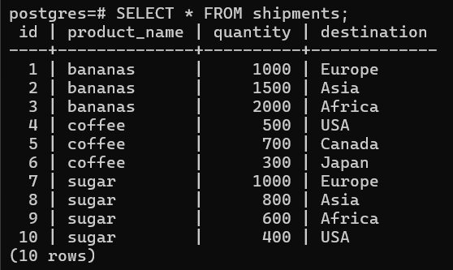

# Создание виртуальной машины

Создаю ВМ аналогичную ВМ из 1-го ДЗ.

# Установка PostgreSQL

Обновляю пакеты:
```bash
sudo apt update && sudo apt upgrade
```

Устанавливаю СУБД PostgreSQL 16:
```bash
sudo apt install postgresql-16
```

# Добавление данных в СУБД

Подключаюсь у СУБД PostgreSQL:
```bash
sudo -u postgres psql
```

Создаю таблицу с данными:
```sql
create table shipments(id serial, product_name text, quantity int, destination text);

insert into shipments(product_name, quantity, destination) values('bananas', 1000, 'Europe');
insert into shipments(product_name, quantity, destination) values('bananas', 1500, 'Asia');
insert into shipments(product_name, quantity, destination) values('bananas', 2000, 'Africa');
insert into shipments(product_name, quantity, destination) values('coffee', 500, 'USA');
insert into shipments(product_name, quantity, destination) values('coffee', 700, 'Canada');
insert into shipments(product_name, quantity, destination) values('coffee', 300, 'Japan');
insert into shipments(product_name, quantity, destination) values('sugar', 1000, 'Europe');
insert into shipments(product_name, quantity, destination) values('sugar', 800, 'Asia');
insert into shipments(product_name, quantity, destination) values('sugar', 600, 'Africa');
insert into shipments(product_name, quantity, destination) values('sugar', 400, 'USA');
```

Проверяю, что данные выводятся:


# Подключение диска к ВМ

Открываю `Диски и хранилища`:


Нажимаю `Присоединить диск`:

Нажимаю `Создать новый диск`:

Настраиваю диск и нажимаю `Создать`:

Диск добавился:


Проверяю добавление диска с ВМ:

Создаю раздел на диске:
```bash
sudo fdisk /dev/vdb
```

Появился раздел:

Выполняю форматирование раздела в файловую систему ext4:
```bash
sudo mkfs.ext4 /dev/vdb1
```

Создаю папку для монитрования:
```bash
sudo mkdir -p /mnt/external
```

Монтирую диск:
```bash
sudo mount /dev/vdb1 /mnt/external
```
Проверяю монтирование:
```bash
df -h | grep external
```

Узнаю UUID диска:
```bash
sudo blkid /dev/vdb1
```

## Добавление автоматического монтирования диска при перезагрузке
Создаю systemd unit:
```bash
sudo nano /etc/systemd/system/mnt-external.mount
```
```
[Unit]
Description=External data disk

[Mount]
What=/dev/disk/by-uuid/f47916dd-fb96-4402-87b2-956840799095
Where=/mnt/external
Type=ext4
Options=defaults,noatime

[Install]
WantedBy=multi-user.target
```
Активирую автоматическое монтирование:
```bash
sudo systemctl daemon-reload

sudo systemctl enable mnt-external.mount

sudo systemctl start mnt-external.mount

sudo systemctl status mnt-external.mount
```


Перезагружаю ВМ:
```bash
sudo reboot
```

Проверяю монтирование:
```bash
mount | grep /mnt/external
```


## Перенос данных на новый диск

Подключаюсь к СУБД PostgreSQL:
```bash
sudo -u postgres psql
```
Узнаю расположение директории данных:
```Psql
SHOW data_directory;
```

Узнаю расположение postgresql.conf:
```Psql
SHOW config_file;
```


Создаю директорию для данных на новом диске:
```bash
sudo mkdir -p /mnt/external/postgresql/16
```
Настраиваю права доступа:
```bash
sudo chown -R postgres:postgres /mnt/external/postgresql
```
Останавливаю сервис СУБД:
```bash
sudo systemctl stop postgresql@16-main.service
```
Переношу директорию данных:
```bash
sudo cp -rp /var/lib/postgresql/16/main /mnt/external/postgresql/16
```
- `-r` - рекурсивное копирование. Включает все подкаталоги;
- `-p` - копирование с сохранением атрибутов. Владельцем останется postgres, а не root.

Проверяю корректность переноса:
```bash
sudo ls -la /mnt/external/postgresql/16/main
```

Корректирую расположение директории данных в конфигурационном файле postgresql.conf:
```bash
sudo nano /etc/postgresql/16/main/postgresql.conf
```
```
data_directory = '/mnt/external/postgresql/16/main'
```

Запускаю СУБД:
```bash
sudo systemctl start postgresql@16-main.service
```

Подключаюсь к СУБД:
```bash
sudo -u postgres psql
```

Проверяю, что данные на месте:
```SQL
SELECT * FROM shipments;
```
